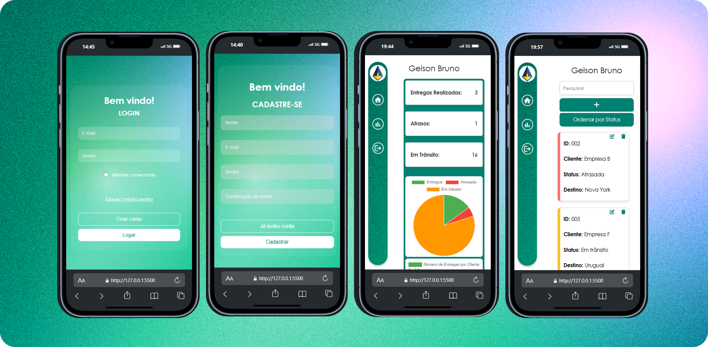

# Columbus Logistics

## 📚 Sobre o Projeto

O Columbus Logistics é uma aplicação web desenvolvida para controle de entregas e logística. Este projeto foi realizado como parte de um teste técnico, utilizando HTML, CSS, e JavaScript.

O sistema possui funcionalidades para login, cadastro de usuários e visualização de métricas e entregas.

## 📖 Tabela de Conteúdo

- [Instalação](#-instalação)
- [Como Usar](#-como-usar)
- [Tecnologias Utilizadas](#-tecnologias-utilizadas)
- [Funcionalidades](#️-funcionalidades)
- [Demonstração em GIF](#-demonstração-em-gif)
- [Captura de Tela Mobile](#-captura-de-tela-mobile)

## 🌐 Demonstração em GIF


## 📱 Captura de Tela (Mobile)



## 💻 Instalação

1. Clone o repositório

```bash
git clone https://github.com/geisonbruno/challenge-columbus
```

2. Navegue até a pasta do projeto:

```bash
   cd challenge-columbus
```

3. Abra o arquivo _login.html_ diretamente no navegador ou utilize um servidor local.

```bash
  live-server
```

## 🚀 Como Usar

Após inicializar o projeto, você pode acessar as seguintes funcionalidades:

1 - Tela de Login:

- Faça login com as credenciais cadastradas.

2 - Tela de Cadastro:

- Crie novos usuários com validação dos campos.

3 - Dashboard:

- Visualize dados de entregas, incluindo:
- Status (Entregue, Atrasado, Em Trânsito).
- KPIs e gráficos interativos.
- Lista detalhada de entregas com opção de ordenação.
- Cards responsivos permitindo editar e excluir.

# ⚙️ Funcionalidades

### Tela de login

- Validação de campos obrigatórios.
- Criptografia de senha com SHA-256.

### Tela de Cadastro

- Registro de novos usuários.
- Armazenamento de dados no LocalStorage.

### Dashboard

- Gráficos dinâmicos com visualização de status de entregas, bom base de dados conforme entregas, em transito e atrasos.
- KPIs atualizados em tempo real.
- Listagem detalhada com opção de ordenação e filtros.
- Cards responsivos permitindo editar ou excluir.

## 🛠️ Tecnologias Utilizadas

- HTML5: Estrutura do projeto.
- CSS3: Estilização, responsividade e animações.
- JavaScript: Lógica de interatividade e manipulação de dados.
- LocalStorage: Persistência de dados no navegador.
